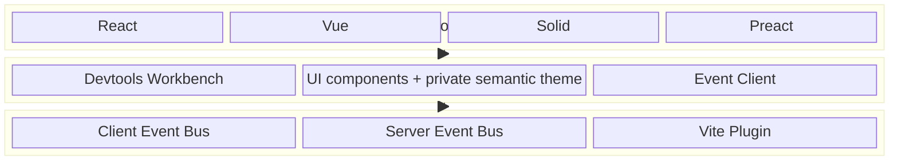
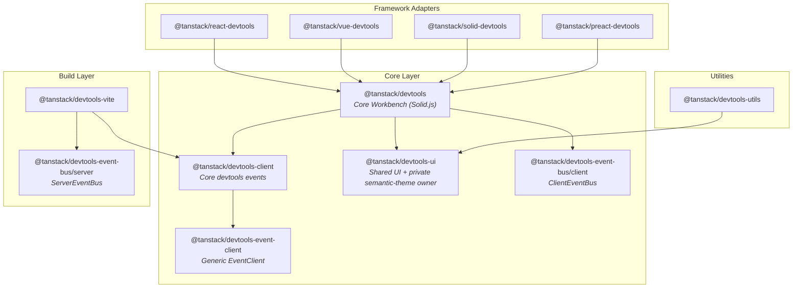
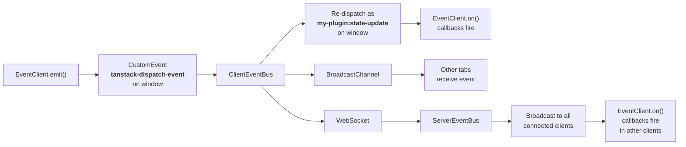

TanStack Devtools is a modular system of packages organized into three layers: **Framework Adapters**, **Core Shell**, and **Event Transport**. This architecture lets you use pre-built devtools panels or build your own custom ones, regardless of which frontend framework you use.



## Package Dependency Graph



Each framework adapter depends only on `@tanstack/devtools`. The core shell pulls in everything it needs, so end users install just two packages: their framework adapter and the Vite plugin.

## Transport Layer

The transport layer handles event delivery between plugins, the devtools UI, and (optionally) a dev server. It is composed of three pieces.

### ServerEventBus (`@tanstack/devtools-event-bus/server`)

Runs inside the Vite dev server process (Node.js). It creates an HTTP server (or piggybacks on Vite's existing server when HTTPS is enabled) that accepts both **WebSocket** and **SSE** connections. When a message arrives from any client, the server broadcasts it to every other connected client and dispatches it on a server-side `EventTarget` so server-side listeners (like the Vite plugin's package-manager helpers) can react to it.

Key details:
- Default port is `4206`, auto-increments if the port is in use.
- Handles `/__devtools/ws` for WebSocket upgrades, `/__devtools/sse` for SSE streams, and `/__devtools/send` for SSE POST fallback.
- Sets `globalThis.__TANSTACK_EVENT_TARGET__` so that `EventClient` instances running on the server can dispatch events onto the same target.

### ClientEventBus (`@tanstack/devtools-event-bus/client`)

Runs in the browser. Started automatically when the core shell mounts via `TanStackDevtoolsCore.mount()`. Its responsibilities:

1. **Local dispatch** -- Listens for `tanstack-dispatch-event` CustomEvents on `window`, re-dispatches them as both a type-specific CustomEvent (e.g. `my-plugin:state-update`) and a global `tanstack-devtools-global` event so listeners can subscribe to individual event types or to all events.
2. **Server forwarding** -- If connected to a server bus, forwards every dispatched event over WebSocket (preferred) or SSE POST fallback.
3. **Cross-tab sync** -- Uses `BroadcastChannel('tanstack-devtools')` to replicate events across browser tabs without round-tripping through the server.
4. **Connection handshake** -- Responds to `tanstack-connect` events with `tanstack-connect-success`, allowing `EventClient` instances to discover the bus.

### EventClient (`@tanstack/devtools-event-client`)

The high-level, typed API that plugins use to send and receive events. Each `EventClient` is created with a `pluginId` and a type map that defines the events it can emit and listen to.

```ts
import { EventClient } from '@tanstack/devtools-event-client'

type MyEvents = {
  'state-update': { count: number }
  'reset': void
}

const client = new EventClient<MyEvents>({ pluginId: 'my-plugin' })
```

When you call `client.emit('state-update', { count: 42 })`, the EventClient:

1. Dispatches a CustomEvent on its internal `EventTarget` (for same-page listeners using the `withEventTarget` option).
2. Dispatches a `tanstack-dispatch-event` CustomEvent on the global target (typically `window`), with a payload of `{ type: 'my-plugin:state-update', payload: { count: 42 }, pluginId: 'my-plugin' }`.
3. The `ClientEventBus` picks up that `tanstack-dispatch-event`, re-dispatches it as a `my-plugin:state-update` CustomEvent on `window`, and forwards it to the server bus via WebSocket.

When you call `client.on('state-update', callback)`, the EventClient registers a listener on the global target for `my-plugin:state-update` events, so it receives events regardless of whether they came from a local emit or from the server bus.

> [!NOTE]
> The server bus is optional. Without the Vite plugin, `EventClient` still works for same-page communication via CustomEvent dispatch on `window`. Events simply won't cross tab or process boundaries.

### Event Flow Summary



## Core Layer

### @tanstack/devtools -- The Shell

The devtools shell is a Solid.js application that renders the entire devtools UI. It exposes the `TanStackDevtoolsCore` class with three methods:

- **`mount(el)`** -- Renders the Solid.js devtools application into the given DOM element. Starts a `ClientEventBus` and lazy-loads the UI. Wraps everything in a `DevtoolsProvider` (reactive store for plugins, settings, state) and a `PiPProvider` (Picture-in-Picture support).
- **`unmount()`** -- Tears down the Solid.js app and stops the event bus.
- **`setConfig(config)`** -- Updates configuration and plugins at runtime. Plugins are reactive: adding or removing them updates the tab bar immediately.

The shell renders:
- A **trigger button** (the floating devtools toggle, customizable or replaceable)
- A **resizable Workbench panel** (docked to the top or bottom of the viewport, resizable via pointer or keyboard)
- A compact **36px TanStack Devtools header** with Plugins, Marketplace, SEO, and Settings destinations. The palm emblem is inline SVG, so it stays sharp and takes its colour from the theme.
- A fixed-height **44px secondary strip** for plugin and SEO navigation. It scrolls horizontally when space is limited, and a pull tab on its bottom edge folds it away behind the header. Folding changes nothing else — the panel keeps its height and the destination content keeps running — so the tab is rendered only on the destinations that have a strip.
- A separate **Marketplace** header tab that does not disturb mounted plugin panes
- A **settings panel** for theme, hotkeys, position, and other preferences
- Up to three simultaneous **plugin mount frames**, divided into equal widths by static separators

Settings and UI state (panel size, position, active tab, theme) are persisted in `localStorage` so they survive page reloads.

The core shell owns the Workbench header, navigation, mount-frame geometry, separators, and surrounding light/dark surfaces. Each external plugin owns everything inside its mount target; core styling deliberately does not reach into plugin descendants. Detaching the Workbench uses a fixed `100vh` Picture-in-Picture layout and restores the stored docked height when reattached.

#### Workbench surfaces and gutters

Two rules keep the shell reading as one surface:

- **Chrome versus canvas.** The header and every secondary strip paint the brand surface (cream in light mode, near-black in dark mode) and close with a translucent ink hairline. Destination content and plugin mount frames paint the workspace surface. A plugin pane can paint any colour it likes, so the separator between panes uses a mid-tone border that stays visible against both.
- **One gutter.** `WORKBENCH_GUTTER` (16px, or `WORKBENCH_GUTTER_NARROW` at 12px below 430px) is the single inline gutter. The header, the strips, and each destination's content all start there, so the left edge is one column instead of three. `MainPanel withPadding` uses the same value.

Colour comes from the semantic theme only. Raw hex values in core-owned source are rejected by `tests/semantic-color-usage.test.ts` unless they carry a narrow, path-scoped `semantic-color-exempt` marker — currently only third-party network marks and the source-inspector highlight alpha. Status colours (success, warning, error, info) mark real state; identity accents do not compete with them, so a card that is both featured and active keeps the neutral outline and lets its badge say which it is.

### @tanstack/devtools-ui -- Component Library

A shared Solid.js component library used by the core shell and available for use in Solid.js plugins. Provides buttons, inputs, checkboxes, a JSON tree viewer, section layouts, and other UI primitives. The `@tanstack/devtools-utils` package also depends on it to provide framework-specific plugin helpers.

Core packages share a private semantic resolver through `@tanstack/devtools-ui/internal`. It supplies TanStack light/dark colors, typography, spacing, status roles, and focus treatment to core-owned UI and the accessibility plugin. This internal subpath is an implementation boundary, not a public theming API for application plugins.

### @tanstack/devtools-client -- Core Event Client

A specialized `EventClient` pre-configured with `pluginId: 'tanstack-devtools-core'` and a fixed event map for devtools-internal operations:

- `mounted` -- Fired when the devtools UI has mounted, triggers the server to send current package.json and outdated dependency data.
- `package-json-read` / `outdated-deps-read` -- Carries project metadata from the Vite server to the devtools UI.
- `install-devtools` / `devtools-installed` -- Request/response cycle for installing a plugin package from the marketplace.
- `add-plugin-to-devtools` / `plugin-added` -- Request/response cycle for injecting a plugin into the user's source code.
- `trigger-toggled` -- Synchronizes the open/closed state of the devtools panel.

This client is a singleton (`devtoolsEventClient`) used by both the core shell and the Vite plugin to coordinate.

## Framework Layer

Each framework adapter is a thin wrapper that bridges its framework's component model to the core Solid.js shell. The pattern is the same across all adapters:

1. **Creates a `TanStackDevtoolsCore` instance** with the user's plugins and config.
2. **Mounts it to a DOM element** using the framework's lifecycle APIs, such as `useEffect` in React, `onMounted` in Vue, `$effect` in Svelte, and `onMount` in Solid.
3. **Converts framework-specific plugin definitions** into the core's DOM-based `render(el, props)` interface. Each adapter defines its own plugin type (e.g. `TanStackDevtoolsReactPlugin`) that accepts framework-native components, then wraps them in a `render` callback that the core calls with a target DOM element and `{ theme, devtoolsOpen }`.
4. **Uses the framework's rendering API** to render plugin components into the core's DOM containers:
   - **React** -- `createPortal()` from `react-dom`
   - **Vue** -- `<Teleport :to="'#' + plugin.id" />`
   - **Solid** -- `<Portal mount={el} />`
   - **Preact** -- Same portal pattern as React
   - **Svelte** -- `mount(component, { target: el, props })`
   - **Angular** -- `createComponent()` with the container's environment injector

The key insight: the core shell is always Solid.js, but your plugins run in **your** framework. Each adapter receives the same plugin props and renders a native framework component into a DOM element created by the Solid.js shell. The adapters bridge this gap so you never need to think about Solid.js unless you want to.

### What an adapter does NOT do

Adapters do not re-implement the devtools UI, manage settings, handle events, or communicate with the server. All of that lives in the core shell. Adapters are intentionally minimal -- typically a single file under 300 lines.

## Build Layer

`@tanstack/devtools-vite` is a collection of Vite plugins that enhance the development experience and clean up production builds. It returns an array of Vite plugins, each handling a specific concern:

### Source injection (`@tanstack/devtools:inject-source`)
Parses JSX/TSX files with oxc-parser and injects `data-tsd-source` attributes on every JSX element via MagicString. These attributes encode the file path, line number, and column number of each element in source code, which the source inspector feature uses to implement click-to-open-in-editor.

### Server event bus (`@tanstack/devtools:custom-server`)
Starts a `ServerEventBus` on the Vite dev server. Also sets up middleware for the go-to-source editor integration and bidirectional console piping (client logs appear in the terminal, server logs appear in the browser).

### Production stripping (`@tanstack/devtools:remove-devtools-on-build`)
On production builds, transforms any file that imports from `@tanstack/*-devtools` to remove the devtools imports and JSX usage entirely. This means devtools add zero bytes to your production bundle.

### Console piping (`@tanstack/devtools:console-pipe-transform`)
Injects a small runtime into your application's entry file that intercepts `console.log/warn/error/info/debug` calls and forwards them to the Vite dev server via HTTP POST. The server then broadcasts them to connected SSE clients, enabling server-to-browser log forwarding.

### Enhanced logging (`@tanstack/devtools:better-console-logs`)
Transforms `console.*` calls to prepend source location information (file, line, column), making it possible to click a console log and jump directly to the source.

### Plugin marketplace support (`@tanstack/devtools:event-client-setup`)
Listens for `install-devtools` events from the devtools UI, runs the package manager to install the requested package, and then uses AST manipulation to inject the plugin import and configuration into the user's source code.

### Connection injection (`@tanstack/devtools:connection-injection`)
Replaces compile-time placeholders (`__TANSTACK_DEVTOOLS_PORT__`, `__TANSTACK_DEVTOOLS_HOST__`, `__TANSTACK_DEVTOOLS_PROTOCOL__`) in the event bus client code with the actual values from the running dev server, so the client automatically connects to the correct server.

## Data Flow

To tie everything together, here is what happens when a plugin emits an event end-to-end:

1. **Your library code** calls `eventClient.emit('state-update', data)`.

2. **EventClient** constructs a payload `{ type: 'my-plugin:state-update', payload: data, pluginId: 'my-plugin' }` and dispatches it as a `tanstack-dispatch-event` CustomEvent on `window`.

3. **ClientEventBus** receives the `tanstack-dispatch-event`. It does three things:
   - Dispatches a CustomEvent named `my-plugin:state-update` on `window` so that any `eventClient.on('state-update', callback)` listeners on this page fire immediately.
   - Dispatches a `tanstack-devtools-global` CustomEvent on `window` so that `onAll()` and `onAllPluginEvents()` listeners fire.
   - Posts the event to the `BroadcastChannel` so other tabs receive it.

4. **If connected to the server bus**, ClientEventBus also sends the event over WebSocket to `ServerEventBus`.

5. **ServerEventBus** receives the WebSocket message and broadcasts it to all other connected clients (WebSocket and SSE). It also dispatches the event on its server-side `EventTarget` so server-side listeners (e.g., the Vite plugin) can react.

6. **In other browser tabs/windows**, the event arrives via WebSocket from the server (or via BroadcastChannel from step 3). The local `ClientEventBus` dispatches it as a `my-plugin:state-update` CustomEvent, and any `eventClient.on('state-update', callback)` listeners fire with the data.

Without the Vite plugin and server bus, steps 4-6 are skipped, but steps 1-3 still work. This means plugins can communicate within a single page without any server infrastructure -- the server bus just adds cross-tab and cross-process capabilities.
